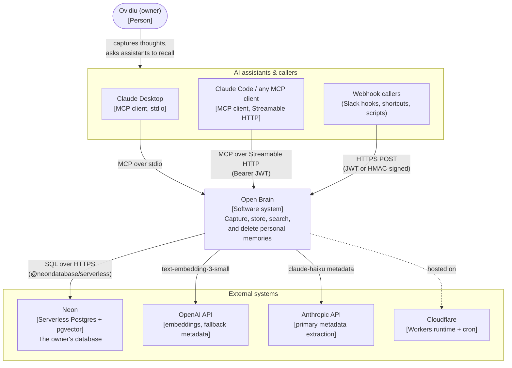
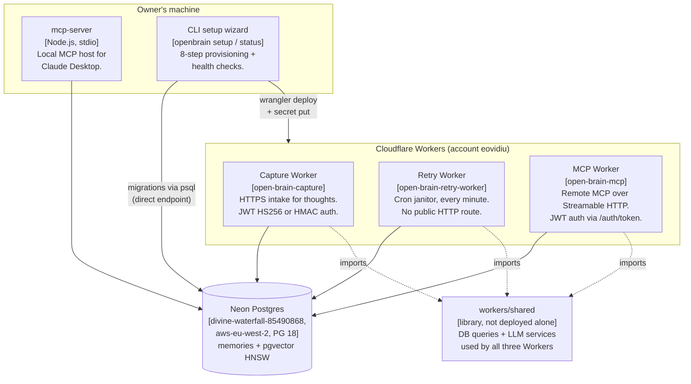
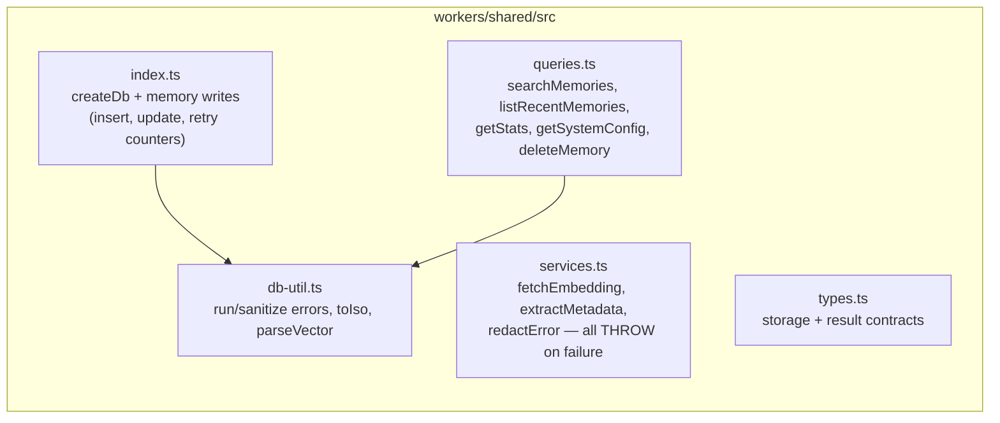
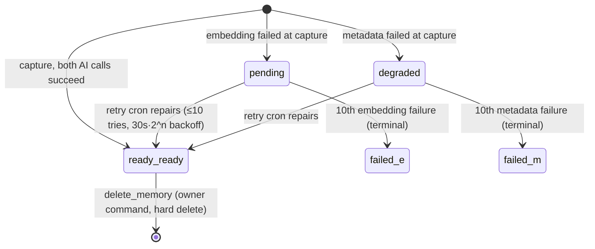

# Open Brain — Architecture (C4 Model)

**Status**: reflects the deployed system as of 2026-07-06 (spec v1.2.0)
**Audience**: anyone who needs to understand, operate, or extend the system
**Authoritative behavior contract**: [open-brain-spec.md](open-brain-spec.md) — where this
document and the spec disagree, the spec wins and this document has a bug.

This document describes the system top-down using the [C4 model](https://c4model.com):
Context (who uses it and what it talks to), Containers (the deployable pieces),
Components (what's inside each piece), and Code (the data model and contracts the
pieces agree on).

---

## Level 1 — System Context

Open Brain is a **personal, vendor-neutral memory system for AI assistants**. One
person (the owner) captures thoughts through whatever tool is at hand; every AI
assistant the owner uses can then search, list, and delete those memories through
the Model Context Protocol (MCP). No AI vendor owns the data — it lives in the
owner's own Postgres database.

**Key context facts**

- Single owner, single tenant. There is no multi-user model anywhere (spec §1.4).
- Every stored thought (`raw_text`) is transmitted to OpenAI (embedding) and to the
  configured metadata provider. This is a deliberate, documented trade-off (spec §7.3).
- **Durability over speed**: a thought is never rejected because an AI call failed —
  it is stored in a degraded state and repaired later (spec §1.3, AD-6).
- Everything runs on free tiers (Neon free plan, Cloudflare Workers free plan);
  the only metered costs are OpenAI/Anthropic API calls (~$0.4/month at ~20 thoughts/day).

---

## Level 2 — Containers

Six containers. Three run on Cloudflare's edge, one runs on the owner's Mac, one is
a database, and one is a command-line tool run on demand.

### Container: Capture Worker (`workers/capture/`)

- **URL**: `https://open-brain-capture.eovidiu.workers.dev` (custom domain: backlog)
- **Purpose**: the single HTTP intake for new memories from webhook-style callers.
- **Auth** (either of, checked in this order):
  - `Authorization: Bearer <JWT>` — HS256, secret `CAPTURE_JWT_SECRET`, subject must
    be `open-brain-owner`, expiry enforced, `alg` confusion rejected.
  - HMAC headers `X-OpenBrain-Signature: sha256=<hex>` + `X-OpenBrain-Timestamp` —
    HMAC-SHA256 over `timestamp.body` with `CAPTURE_WEBHOOK_SECRET`; requests
    older or newer than **5 minutes** are rejected (replay protection).
- **Behavior**: validate (`text` ≤ 10,000 chars, `source` in enum) → rate limit
  (60 req/min per credential) → call embedding + metadata **in parallel**
  (`Promise.allSettled`) → insert the row whatever happened (AD-6) → `201` with the
  stored record. Failures degrade: embedding failure ⇒ `embedding_status='pending'`,
  metadata failure ⇒ `metadata_status='degraded'`. CORS is deliberately closed
  (no wildcard origin — server-to-server only).

### Container: Retry Worker (`workers/retry/`)

- **Trigger**: Cloudflare Cron `* * * * *` (every minute). **No public route** — its
  `fetch` handler returns 404 for everything (AD-2).
- **Behavior**: each run calls the SQL function `get_retry_eligible_memories(20)`
  (the *only* source of retry eligibility, AD-7), then repairs each row: missing
  embedding → OpenAI call → `embedding_status='ready'`; degraded metadata → LLM
  call → `metadata_status='ready'`. Embedding and metadata repairs run in parallel
  per record. Failures increment per-kind retry counters with **exponential backoff**
  (eligible again `30s × 2^count` after capture); at **10 failures** the status
  becomes terminally `'failed'` — enforced atomically in SQL, not in Worker code.
- **Concurrency stance**: no row locking. Overlapping runs can at worst duplicate an
  LLM call and double-increment a counter — success writes are idempotent (reviewed
  and accepted; see cutover runbook).

### Container: MCP Worker (`workers/mcp/`)

- **URL**: `https://open-brain-mcp.eovidiu.workers.dev`
- **Purpose**: the remote MCP host — any Streamable-HTTP-capable MCP client can use
  the owner's memory from anywhere.
- **Routes**:
  - `POST /auth/token` — exchanges `{"client_secret": …}` (constant-time compared
    against `MCP_CLIENT_SECRET`) for a 1-hour HS256 JWT. Rate-limited to 5 failed
    attempts per IP per 15 minutes.
  - `GET /health` — DB connectivity + embedding model + memory count.
  - everything else — requires `Authorization: Bearer <JWT>`, then hands the request
    to a **per-request** MCP server instance via the Cloudflare Agents SDK's
    `createMcpHandler()` (stateless by design, AD-4; the SDK requires the
    `nodejs_compat` flag and an alias stub for its unused `ai` import).
- **Tools served**: all five (see Level 3).
- **JWT implementation**: WebCrypto (no Node compat needed for our own code), with a
  cross-implementation compatibility test against the `jsonwebtoken` package to pin
  the standard wire format.

### Container: mcp-server (stdio) (`mcp-server/`)

- **Purpose**: the local MCP host Claude Desktop launches as a child process
  (`node mcp-server/dist/index.js --stdio`). Same five tools as the MCP Worker.
- **Config**: environment injected by Claude Desktop's config entry (written by the
  CLI wizard): `DATABASE_URL`, `OPENAI_API_KEY`, `ANTHROPIC_API_KEY`,
  `EMBEDDING_MODEL`. No HTTP surface, no auth (stdio is local trust).
- **Startup guard**: refuses to start if `system_config.embedding_model` in the
  database disagrees with its configured model (prevents mixed-model vector spaces).
- Historical note: this container once also hosted an Express/SSE remote endpoint;
  that was removed when the MCP Worker replaced it (AD-4).

### Container: CLI setup wizard (`cli/`)

- **Run as**: `npm run dev --workspace=cli` (setup) / `… status` (health).
- **8 steps**: Neon connection string (validated live) → OpenAI key → Anthropic key
  → secret generation → write `.env` → run migrations → deploy the three Workers +
  upload secrets → write Claude Desktop's config. Steps are resumable; completed
  steps offer "Reconfigure?".
- **Safety properties** (added after real-world failures): resolves the repository
  root from its own module location (npm `--workspace` changes the launch cwd);
  never overwrites an existing `.env` without an explicit yes (default no; decline
  leaves the file byte-identical); "already complete" for the `.env` step is judged
  from the file on disk, not from values collected in memory; secret upload lists
  exclude names that are `[vars]` bindings in a Worker's `wrangler.toml`.

### Container: Neon Postgres

- Project `divine-waterfall-85490868` ("open-brain"), region `aws-eu-west-2`, PG 18,
  branch `production`; a `test` branch gates integration tests via
  `NEON_TEST_DATABASE_URL`.
- Reached exclusively through the `@neondatabase/serverless` driver (SQL over HTTPS,
  fits Workers' no-TCP model) — plain SQL, no ORM, no PostgREST (AD-1). Single
  database role; **no RLS** — authorization lives entirely at the HTTP layer (AD-3).
- Migrations: 5 files under `db/migrations/`, applied by `scripts/migrate.sh`
  (psql, `--single-transaction`, tracked in `schema_migrations`, idempotent). DDL
  must use the **direct** endpoint (the `-pooler` host goes through pgbouncer
  transaction pooling, which breaks single-transaction DDL); runtime traffic uses
  the pooled endpoint.

### Library: `workers/shared/`

Not deployed on its own — a standalone package the three Workers import via
`file:../shared`. It exists so the Workers cannot drift apart (they did once; the
divergence caused a production incident, and the consolidation removed the class of
bug). Contents in Level 3.

---

## Level 3 — Components

### workers/shared (the one implementation of everything duplicated before)

- **`services.ts`** — one OpenAI embedding call (`text-embedding-3-small`,
  1536 dims); one metadata extractor: a single 9-type prompt, provider chain that
  honors `METADATA_LLM_PROVIDER` and falls back across providers when a key is
  missing (the general OpenAI key always qualifies — the gap that once stranded the
  retry Worker on an unfunded provider is structurally impossible now, and a named
  regression test pins it). Unified validation: off-list `type` coerces to
  `'unknown'`, arrays cap at 50 items, `sentiment` passes through only if valid,
  `confidence` clamps to [0,1]; only a non-JSON-object response throws.
- **Error-semantics contract**: the shared core **throws**; each consumer chooses
  its own posture — capture paths wrap calls in `Promise.allSettled` and degrade
  (AD-6), the retry Worker lets throws count against the retry budget.
- **`queries.ts`** — the read/delete queries used by both MCP hosts.
  `deleteMemory` is `DELETE … RETURNING id` and throws `Memory not found: <id>`
  on a miss (FR-DEL-03).

### Capture Worker components

| Component | File | Responsibility |
|---|---|---|
| Router/handler | `src/index.ts` | method/CORS gate, orchestration, AD-6 assembly, 201/4xx/5xx envelopes |
| Auth | `src/auth.ts` | JWT HS256 verify (WebCrypto) + HMAC `sha256=` verify with ±5 min window; both constant-time |
| Rate limit | `src/rate-limit.ts` | 60/min per credential, in-memory (resets on isolate recycle — accepted) |
| Env contract | `src/env.ts` | secrets/vars binding shape |

### Retry Worker components

| Component | File | Responsibility |
|---|---|---|
| Cron entry | `src/index.ts` | `scheduled()` → one batch via `ctx.waitUntil`; `fetch()` → 404 always |
| Batch | `src/retry-batch.ts` | `get_retry_eligible_memories(20)` → per-record processing |
| Record repair | `src/process-record.ts` | parallel embedding/metadata repair; increments counters via shared atomic SQL on failure |

### MCP Worker components

| Component | File | Responsibility |
|---|---|---|
| Router | `src/index.ts` | `/auth/token`, `/health`, JWT gate, per-request `createMcpHandler()` |
| JWT | `src/auth/jwt.ts` | WebCrypto HS256 sign/verify, 1 h expiry, `alg:none` rejected |
| Rate limiter | `src/auth/rate-limiter.ts` | token-issuance 5/15 min; capture-tool 60/min |
| Tool host | `src/server.ts` | registers the five tools; maps errors to stable envelopes (`NOT_FOUND`, `DELETE_FAILED`, `RATE_LIMITED`, …) |
| Tools | `src/tools/*.ts` | thin handlers over `workers/shared` |

### mcp-server (stdio) components

| Component | File | Responsibility |
|---|---|---|
| Entry + tool host | `src/index.ts` | startup config guard, registers the five tools (zod schemas) |
| Tools | `src/tools/*.ts` | handlers over its own db layer |
| DB layer | `src/db/queries.ts` | same SQL as workers/shared, reading `process.env` (intentionally separate codebase from the Workers — one runs on Node, one on the edge) |
| LLM services | `src/services/*` | embedding + metadata for the local capture tool |

### The five MCP tools (identical on both hosts)

| Tool | Input | Output | Notes |
|---|---|---|---|
| `search_brain` | `query`, `n≤50`, `filter_type?`, `since?`, `wrap_output?` | ranked results with `similarity_score` | embeds the query, cosine search via `search_memories()` SQL (pgvector HNSW) |
| `list_recent` | `n≤100`, `filter_type?`, `wrap_output?` | newest first | `wrap_output` wraps text in `<memory_content>` boundaries (prompt-injection hygiene, FR-SAFE-02) |
| `get_stats` | — | totals, by-type, by-status, top topics | `get_memory_stats()` SQL |
| `capture_memory` | `text≤10000`, `source?` | same envelope as HTTP capture | same rate limit as HTTP (FR-MCP-02) |
| `delete_memory` | `id` (UUID) | `{id, deleted: true}` | exact-id only, hard delete; miss ⇒ explicit `NOT_FOUND` (FR-DEL-01..04) |

---

## Level 4 — Code: data model and contracts

### The `memories` table (the single source of truth)

| Column | Type | Meaning |
|---|---|---|
| `id` | uuid PK | assigned at capture |
| `raw_text` | text | the thought, verbatim — **never lost, never mutated** |
| `embedding` | vector(1536), nullable | HNSW-indexed; null while pending |
| `embedding_status` | text | `ready` / `pending` / `failed` (CHECK-constrained) |
| `metadata` | jsonb | extractor output (schema below) |
| `metadata_status` | text | `ready` / `degraded` / `failed` |
| `captured_at` | timestamptz | capture time; drives backoff |
| `source` | text | `slack · claude · chatgpt · mcp_direct · api` |
| `retry_count_embedding` / `retry_count_metadata` | int | per-kind repair attempts |
| `last_processing_error` | text, nullable | most recent failure, API keys redacted |

`metadata` JSON: `type` (one of 9: decision, insight, person_note, meeting_debrief,
task, reference, note, meeting_note, unknown), `topics[]`, `people[]`,
`action_items[]` (each ≤50 strings), `confidence` 0–1, `truncated` bool, optional
`sentiment` (positive/neutral/negative/mixed).

### Memory lifecycle (state machine, spec §8)

(`pending`/`degraded` are independent per-kind statuses on the same row and can both
be set; deletion is allowed from any state.)

### SQL functions (applied by migrations, PG-side logic)

- `search_memories(vector, n, filter_type, since)` — cosine similarity over the
  HNSW index, optional type/time filters.
- `get_memory_stats()` — one JSON blob of aggregates.
- `get_retry_eligible_memories(batch)` — the retry Worker's *only* eligibility
  source: `status pending/degraded AND count < 10 AND now() ≥ captured_at + 30s·2^count`.
- Retry counter updates are single `UPDATE … CASE` statements: increment and the
  terminal `failed` flip happen atomically — no read-then-write races.

### Secrets and configuration matrix

| Name | capture | retry | mcp | stdio (Desktop config) | Kind |
|---|---|---|---|---|---|
| `DATABASE_URL` | secret | secret | secret | env | Neon pooled connection string |
| `CAPTURE_JWT_SECRET` | secret | — | secret | — | HS256 signing key (shared: capture verifies, mcp issues) |
| `CAPTURE_WEBHOOK_SECRET` | secret | — | — | — | HMAC key |
| `MCP_CLIENT_SECRET` | — | — | secret | — | token-issuance shared secret |
| `OPENAI_API_KEY` | secret | secret | secret | env | embeddings + metadata fallback |
| `ANTHROPIC_API_KEY` | secret | secret | secret | env | primary metadata |
| `METADATA_LLM_PROVIDER` | **wrangler var** | secret | **wrangler var** | env (defaults anthropic) | `anthropic` everywhere today |
| `EMBEDDING_MODEL` | — | — | **wrangler var** | env | `text-embedding-3-small` |

Rule learned in production: a name bound under `[vars]` in a `wrangler.toml` cannot
also be uploaded as a secret (Cloudflare error 10053) — the CLI's upload lists
encode this.

### Cross-cutting rules

- **Prompt-injection posture**: stored text is data, never instructions — the
  metadata prompt says so explicitly, and retrieval offers `wrap_output` boundaries.
- **Error hygiene**: DB errors are sanitized to `Database operation failed: <context>`
  before crossing any boundary; upstream API error bodies pass through `redactError`
  (API-key patterns masked, 200-char cap) before being persisted or thrown.
- **Testing**: every package has its own Vitest suite (unit tests mock the Neon
  tagged-template driver and `fetch`; integration tests are env-gated on
  `NEON_TEST_DATABASE_URL` against the Neon `test` branch). ~330 tests across six
  packages; 95% coverage gate on touched code; Worker changes additionally require a
  `wrangler deploy --dry-run` bundle check (compat-flag and import-resolution
  failures are invisible to unit tests).
- **Change control**: the spec is amended only via pull request (Prime Rule);
  architecture decisions AD-1…AD-7 are recorded in the spec's ADR section with
  original texts preserved under amendment banners.
